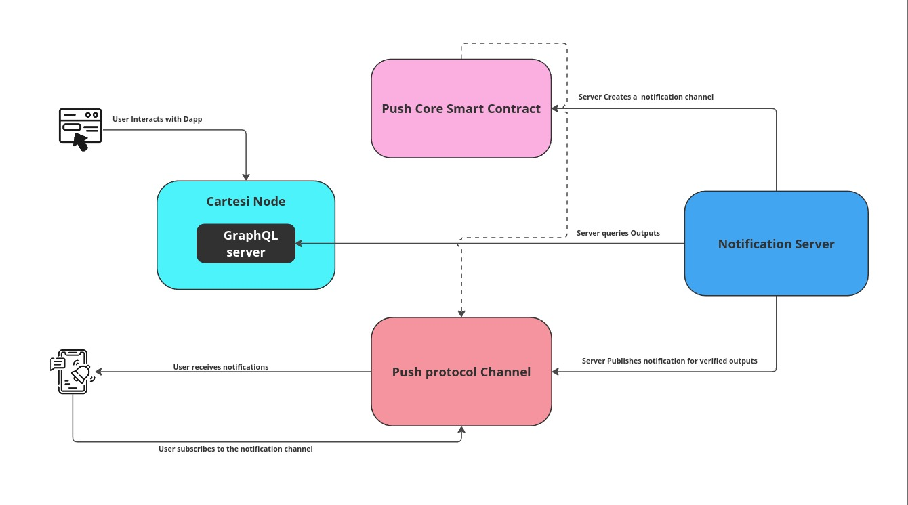

# Cartesi Push Notification Server

A basic cron job which allows Cartesi dApp creators to provide push notifications of new of verified Outputs to users. 

This service plays a crucial role in creating fully interactive Cartesi DApps where the user doesn't need to worry about epoch finalization for verified outputs or simply wants to send simple messages.

The problem becomes glaringly evident when dealing with onchain assets where the user needs to execute a voucher after the epoch is finalized. This service can be very useful to provide an user with notification about unexecuted vouchers for withdrawal of assets.

## Architecture



## Instructions

### Create a push notification Channel

[Official Push protocol Guide](https://push.org/docs/notifications/tutorials/create-your-channel/)

### Replace addresses in the code for cron-job
Inside notification.sender.js change to the address of you channel
```javascript
pushChannelAdress = "0x41070EfeD9Ead91380AAE5e164DAC1001F64C991";
```
Inside graphql/config.js when going for a deploy update the endpoint with the graphql route of your node.
```
endpoint: 'http://localhost:8080/graphql'
```

### Add private key
Start by creating a .env file from the sample and fill with the private key of the channel creator or delegated messager
```
cp .env.sample .env
```

### Using this module

The queries in the cron job that filter for all notices and notices with proofs only. 

The decision to not to include vouchers in the cron job is because after executing, the proof is deleted, which could compromise the expected behaviour.

The primary purpose is to "warn" the user that an epoch has passed, which only requires a proof existing. So the dev can simply create notices together with the vouchers to represent the notification. And given the fact that notices have a more customisable payload it’s easier for the dev to create the notification from inside the dApp logic.

To streamline this process, a default format for a property in the body of the notice was set:"__push_notification__": true 

As mentioned if a user wants to notify the developer about a  execution, rather than generating a notification for every voucher, they can simply create a notice alongside the voucher. 

For example: If a user mints an NFT, they would create a voucher for the minting and simultaneously generate a notice for the notification. There are two types of notifications: instant and proofed. 

- Instant Notification: If the user adds type: "instant" to the notice body, the notification is sent to subscribers immediately when the notice is generated.
- Proofed Notification: If the user creates a proofed notification the target only receives the notification when the proof is available, i.e., when the epoch closes. 

This approach is beneficial because it gives the developer control over when notifications are sent. They can use notices to manage this process and create proofed notifications alongside vouchers, ensuring that the target is warned when a voucher is ready for execution.

### Run
From inside you cron-job folder:
```
npm start
```

To test you can start the simple-node dApp inside its directory.
After a 
```
cartesi build
```
Perform
```
cartesi start
```

#### Send test inputs
On another terminal window
```
cartesi send generic
```
Send as a string encoding 
```json
{“type”:”instant”,”message”:”sample message”,”target”:”*”}

The type can be one of two values:
- instant: The cron job will create a push notification as soon as the notice is created
- proof: The push notification is only created when the epoch of that notice closes.

The target field can be a wallet address to be the destination of the message or * for broadcasts to everyone who subscribes to the channel.

## Deploying 
Once you deploy 

## Demo Video

[Demo](https://youtu.be/SO-xhHT85Bk)